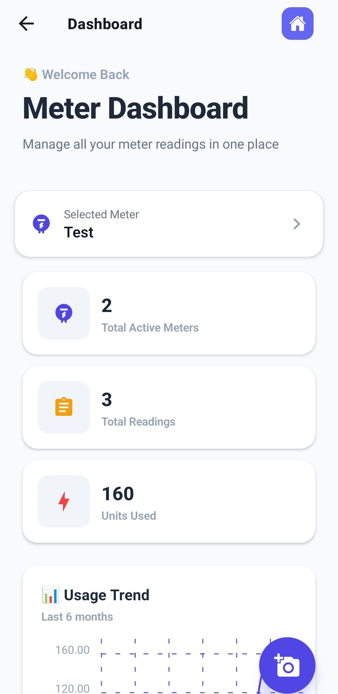

# 📱 Meter Reading Mobile App

A simple and efficient mobile application to manage meter readings, calculate usage, and track monthly costs.

---

## 🚀 Features

- ➕ Add and manage meters
- 💰 Set per unit rate
- 📸 Capture meter reading with image
- ✍️ Manual reading input
- 💾 Save readings locally using SQLite
- 📊 Monthly analysis of:
  - Units consumed
  - Total cost
  - Sales tax calculation
- 🧮 Automatic bill calculation

---

## 📱 App Flow

1. Add a Meter  
2. Set Unit Rate  
3. Add Reading (Image + Manual Input)  
4. Save Data  
5. View Monthly Analysis & Cost Calculation  

---

## 🛠️ Tech Stack

- **Frontend:** React Native (Expo, JSX)
- **Database:** SQLite (Local Storage)

---

## 📸 Screenshots



---

## ⚙️ Installation

```bash
# Clone the repository
git clone [https://github.com/your-username/meter-reading-app.git](https://github.com/Maaz-ul-haq/MeterApp.git)

# Navigate to project folder
cd meter-reading-app

# Install dependencies
npm install

# Run the app
npx expo start
